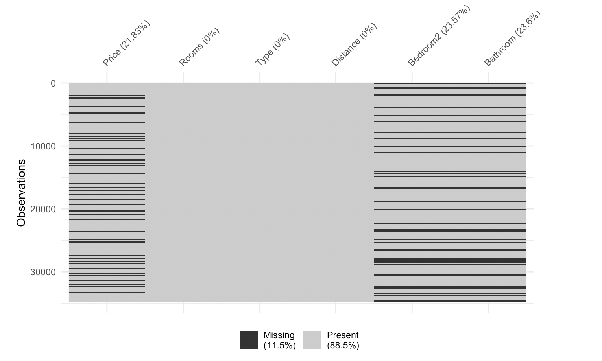

```{r setup, include=FALSE}
knitr::opts_chunk$set(eval = FALSE)
```

# <span style="color:blue"> Exercise 4: Exploring housing prices in Melbourne</span>

#### **Estimated time: 25 min**

```{r library, message=FALSE}
library(tidyverse)
library(naniar)
library(simputation)
```

We are going to examine Melbourne house prices, using a data set available at https://www.kaggle.com/anthonypino/melbourne-housing-market). It was constructed by scraping the auction reports over several years, and adding more information on property details by scraping the web pages on the properties at domain.com.


```{r prepare-data}
houses_raw <- read_csv("data/Melbourne_housing_FULL.csv.gz")
```
## Answer the following questions:

### Q1. Make an overview plot (e.g., vis_dat, vis_miss) of the full data. Which variables have missings? 

```{r use-vis-miss}
___(houses_raw)
```

The graph shows up empty because of limited RAM in RStudio Cloud. `vis_miss()` draws rectangle for each missing data point. This is what the plot actually looks like:




### Q2. Make a missing values summary of all the variables in the data. What proportion of observations are missing on Price?

```{r use-miss-var-summary}
___(houses_raw)
```


### Q3. Remove the observations that have missing values on Price, because this is the response variable that we want to ultimately predict. We can't build a stable model for price if we don't know the price. 

```{r filter-na-price}
houses <- houses_raw %>% ___(___(Price))
___(houses)
```

### Q4. Make the tidy missing data for the houses data- `bind_shadow()`

```{r houses-shadow}
houses_shadow <- ___(___)
houses_shadow
___(houses_shadow)
```

### Q5. Plot Bathroom vs Bedroom2 coloured by missingness on Bedroom2. Why don't any missing values show up?
Hint: `geom_miss_point()`

```{r gg-houses-shadow}
ggplot(houses_shadow,
       aes(x = ___,
           y = ___,
           colour = Bedroom2_NA)) + 
  geom_point()


#To see missing data:
ggplot(houses_shadow,
       aes(x = ___,
           y = ___,)) + 
    ___()
```

### Q6. Impute the missing values for Bedroom2 and Bathroom, by using mean imputation. 

```{r houses-imp}
houses_imp_mean <- ___ %>%
  mutate(Bedroom2 = impute_mean(___),
         Bathroom = impute_mean(___)) %>%
  # identify where there were missings
  add_label_shadow()
houses_imp_mean
```

### Q7. Make a plot of the two variables, Bedroom2 and Bathroom, colouring by imputed values. Describe the pattern that you see.

```{r gg-show-missings}
ggplot(___,
       aes(x = ___,
           y = ___,
           colour = any_missing)) + 
  ___()
```


