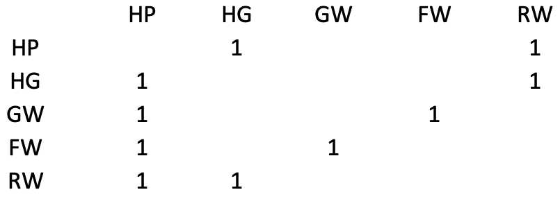

```{r}
library(tidyverse)
library(geomnet)
library(tidytext)
library(plyr)
library(ggrepel)
```

> Ensure you have installed 'geomnet':

```{r}
# install.packages("remotes")
# library(remotes)
# install_github("sctyner/geomnet")
# install.packages(c("tidyverse", "plyr", "tidytext", "ggrepel"))
```


```{r setup, include=FALSE}
knitr::opts_chunk$set(echo = TRUE)
```

## Harry Potter characters

> There is a connection between two students if one provides emotional support to the other at some point in the book. 
- Code to pull the data together is provided by Sam Tyner [here](https://github.com/sctyner/geomnet/blob/master/README.Rmd#harry-potter-peer-support-network).

```{r read-hp1, echo=FALSE}
hp_chars <- read_csv("data/hp_chars.csv")
hp_edges <- read_csv("data/hp_edges.csv")
```

## We need to do a pretty gnarly full join, since we want this for each book:

```{r read-hp}
# for each book, expand the edges data and join it to characters
hp_all <- hp_edges %>%
  group_by(book) %>%
  group_map(~ full_join(.x, hp_chars, by = c("name1" = "name"))) %>%
  bind_rows(.id = "book")  %>% 
  dplyr::rename(from_id = name1, 
         to_id = name2)
```


> We now have it in that form that we wanted i.e., Harry potter data as nodes and edges

```{r print-hp}
hp_all
```

## Let's plot the characters for book 1

```{r plot-hp, echo=TRUE}
hp_all %>%
  filter(book==1) %>%
ggplot(aes(from_id = from_id, 
           to_id = to_id)) + 
  geom_net(aes(colour = house, group = house, shape = gender),
           fiteach=T, 
           directed = T, 
           size = 3, 
           linewidth = .5, 
           ealpha = .5, 
           labelon = T, 
           fontsize = 3, 
           labelcolour = "black", 
           arrowsize = .5, 
           singletons = FALSE) + xlim(c(-.25,1.5)) +
  scale_colour_manual(values = c("#941B08","#F1F31C", "#071A80", "#154C07")) + 
  facet_wrap(~book, labeller = "label_both", ncol=3) + 
  theme_net() + 
  theme(panel.background = element_rect(colour = 'black'),
        legend.position="bottom")
```

## Your Turn

### Q1. Write out the 5x5 adjacency matrix for Harry James Potter, Hermione Granger, George Weasley, Fred Weasley and Ronald Weasley in book 1.
> Subset the data to get the desired characters.

```{r}
main <- c("Harry James Potter", "Hermione Granger", "George Weasley","Fred Weasley", "Ronald Weasley")
hp_subset <- hp_all %>%
  filter(book==1 & from_id %in% main & to_id %in% main )
hp_subset
```



### Q2. In the philosphers stone, who has the most connections?
> Put your data wrangling skills to use.
> Hint: Transform to long format

```{r}
hp_long_1 <- hp_edges %>% 
  filter(book == 1) %>% 
  pivot_longer(cols = c("name1", "name2"),
               names_to = "list",
               values_to = "names") 

hp_long_1 %>% 
  dplyr::count(names, sort = TRUE)
```

### Q3. In the philosphers stone, who has the least connections?
```{r}
hp_long_1 %>% 
  dplyr::count(names) %>% 
  arrange(n)
```

### Q4. Across all the books, can you show the number of connections?
```{r, fig.height= 10, fig.width=10}
# Put it in long form
hp_long <- hp_edges %>% 
  pivot_longer(cols = c("name1", "name2"),
               names_to = "list",
               values_to = "names") 
  
# grouping by book, count up the names 
hp_count <- hp_long %>% 
  group_by(book) %>% 
  dplyr::count(names) %>% 
  mutate(book = as.factor(book),
           name = reorder_within(names, n, book))
  
# Can you make a plot of the number of connections across the books?
ggplot(hp_count,
       aes(x = n,
           y = name)) + 
  geom_col()  +
    scale_y_reordered() +
  facet_wrap(~book, scales = "free") +
  labs(y = "Character names",
         x = NULL,
         title = "Number of connections in each book")
```

### Q5. Plot the characters for all books
```{r, fig.height=10, fig.width=10}
hp_all %>%
ggplot(aes(from_id = from_id, 
           to_id = to_id)) + 
  geom_net(aes(colour = house, group = house, shape = gender),
           fiteach=T, 
           directed = T, 
           size = 3, 
           linewidth = .5, 
           ealpha = .5, 
           labelon = T,
           fontsize = 3, 
           # repel = T,
           labelcolour = "black", 
           arrowsize = .5, 
           singletons = FALSE) + 
  scale_colour_manual(values = c("#941B08","#F1F31C", "#071A80", "#154C07")) + xlim(c(-.5,1.5))+
  facet_wrap(~book, labeller = "label_both", ncol=3) + 
  theme_net() + 
  theme(panel.background = element_rect(colour = 'black'),
        legend.position="bottom")
```

## Try exploring the other datasets in the `geomnet` package:
```{r}
library(geomnet)

?geomnet::bikes
?geomnet::blood
?geomnet::email
```

